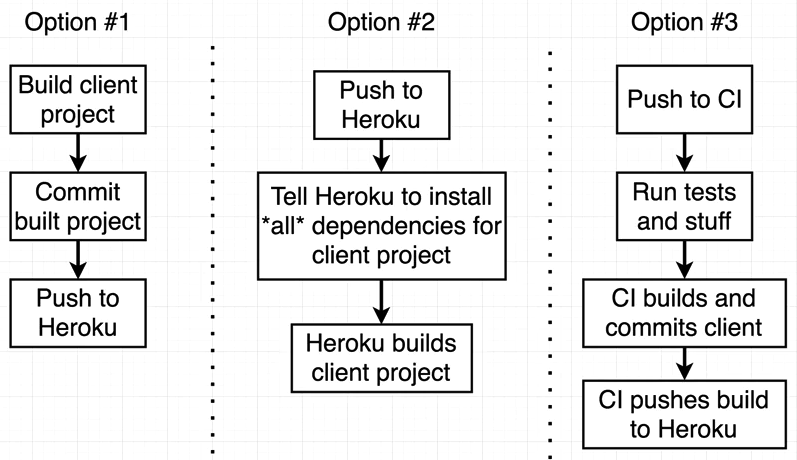

# Full-stack web application project structure
  server side and client have package.json separately.

  
  

## Server side architecture
  - express  
  - passport + passport-google-oauth20
  - cookie-session
  - mongoose

## Client side architecure
  npm install -g create-react-app  

  create-react-app client

  cd client 

  npm start

  - react
  - react-dom
  - redux
  - react-router-dom
  

## Run server and client together
  "dev": "concurrently \"npm run server:dev\" \"npm run client\""

## Prod deployment
    
    
    Continuous Integration (CI)  circleci.com

    In this project we use option 2:
    - https://devcenter.heroku.com/articles/nodejs-support#customizing-the-build-process

    - push to heroku
    - tell heroku install all dependencies and run "npm run build"  
      -    "heroku-postbuild": "NPM_CONFIG_PRODUCTION=false npm install --prefix client && npm run build --prefix client"
 
    We set NPM_CONFIG_PRODUCTION to true by default to install production dependencies only. If you would like to install devDependencies, you can disable production mode: