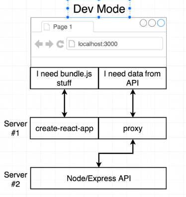
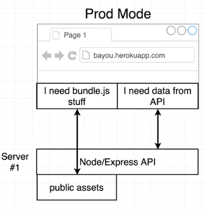

# Full-stack web application project structure
  server side and client have package.json separately.
  
  
  

## Server side architecture
  - express  
  - passport + passport-google-oauth20
  - cookie-session
  - mongoose

## Client side architecure
  npm install -g create-react-app  

  create-react-app client

  cd client 

  npm start

  - react
  - react-dom
  - redux
  - react-router-dom
  

## Run server and client together
  "dev": "concurrently \"npm run server:dev\" \"npm run client\""