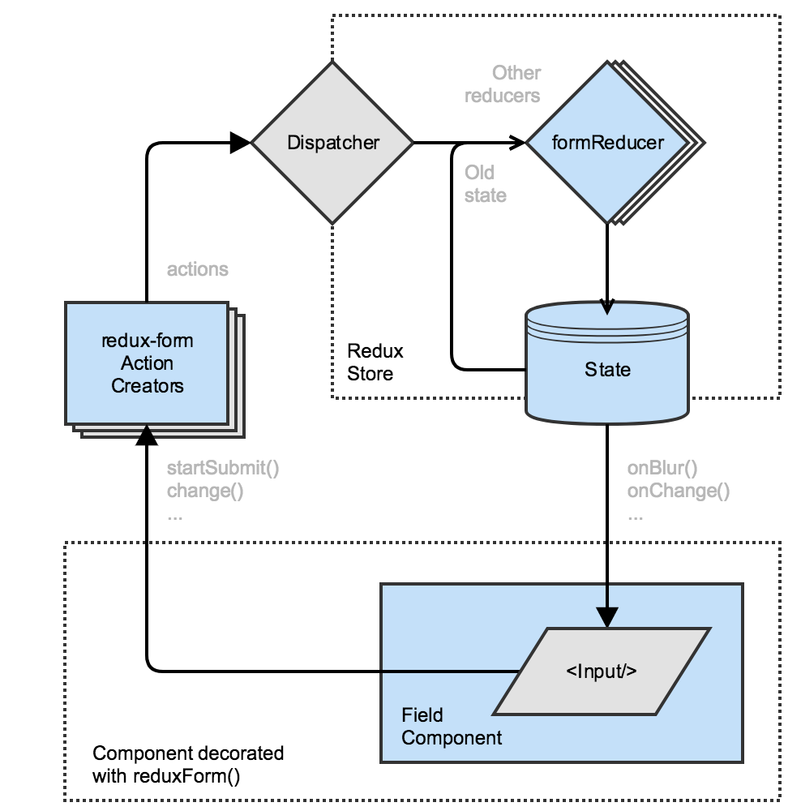

##
  npm i -S redux-form

## redux-form data flow
  http://redux-form.com/7.0.3/docs/GettingStarted.md/

  

  Typing calls action creator, updates state in the redux store

  form reducer records and manage all values from the form.

## Add reducer
  ```
  import { reducer as FormReducer} from 'redux-form';
  
  const reducers = combineReducers({
    auth: AuthReducer,
    form: FormReducer
  });
  ```
## Form and field
  - Field component="input" will create a tag <input>
  - type="text" will be pass to tag <input> as an attribute

  ```
  <form onSubmit={this.props.handleSubmit(values=> console.log(values))}>
    <Field type="text" name="surveyTitle" component="input"/>
    <button type="submit">Submit</button>
  </form>
  ```

  Custom field component
  ```
  <Field key={name} component={SurveyField} type="text" label={label} name={name}/>

  ```
  redux-from will automatically pass props to component.
  The props:
  {
    input:{
      name:"title",
      value:'',
      onBlur: function(),
      onChange: function(),
      ...
    },
    meta:{

    },
    type:'text'
  }
  
  Hook form component to redux form library
  ```
  import { reduxForm } from 'redux-form';

  ...
  export default reduxForm({form: 'surveyForm'})(SurveyForm);
  ```

## Validation
```
  // check each value of input and return a error dict {fieldname: error}
  function validate(values) {
    const errors = {};

    errors.recipients = validateEmails(values.recipients || '');

    // require fields
    _.each(formFields, ({ name }) => {
      if (!values[name]) {
        errors[name] = 'You must provide a value';
      }
    });

    return errors;
  }

  export default reduxForm({validate,form: 'surveyForm'})(SurveyForm);
```

## Submit
  ```
  <form onSubmit={this.props.handleSubmit(values=>{console.log(values)})}>
     <button type="submit"> Submit </button>
  </form>
  ```
  this.props.handleSubmit() was created by redux from after hooking form component to reduxForm library


