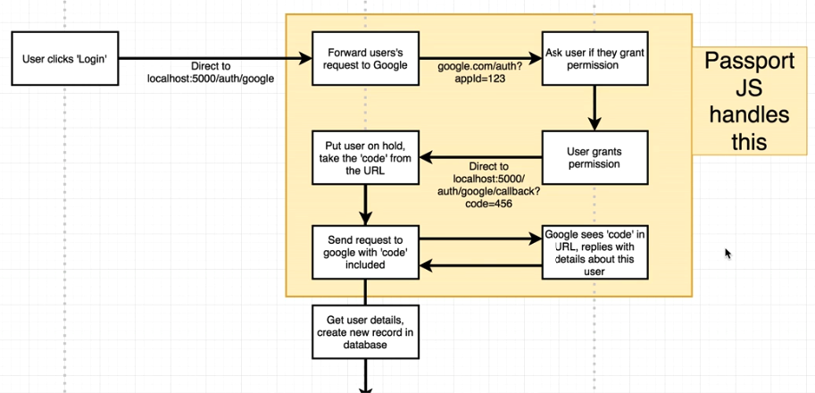

## OAuth workflow
  
  
## OAuth dependencies
  npm i -S passport passport-google-oauth20
  
  passport   (Core passport library, handling auth in Express apps)
  
  passport-strategy (Authing with google, facebook or local database)

## Create Google account and manage Google API
  https://console.developers.google.com

  - Create project
  - Enable API -> Google+ API
  - Create API credentials-> setup consent screen 
  - Put the keys into config file

## Test
  Access http://localhost:5000/auth/google

  There will be Error: redirect_uri_mismatch
  To fix this issue, we need to set "Authorized redirect URIs" in google developer console

  After that, google oauth will redirect back to application
  http://localhost:5000/auth/google/callback?code=4/V1GCxS4cT6TGDnaW5pQRHNSaLgvVxJ602nfvr40UJcw#